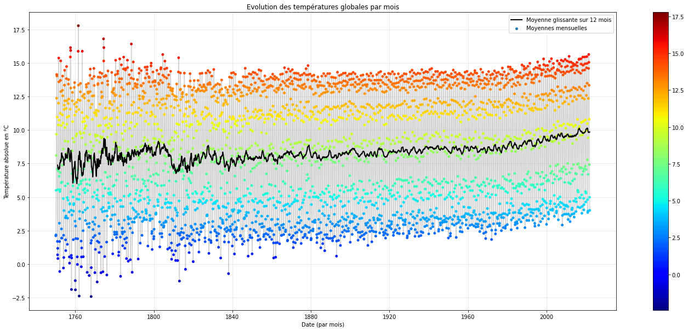

# UnhapPy Earth

Étude de cas : Analyse du réchauffement climatique. Analyse approfondie des données en rapport avec nos questions de recherche, et modélisation.

# Introduction

# Initialisation du Notebook

## Utilisation de Google Colaboratory

## Packages

## Fonctions

Test d'image

## Questions de recherche

