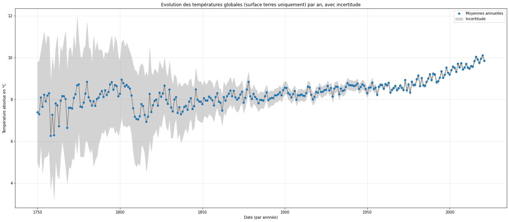
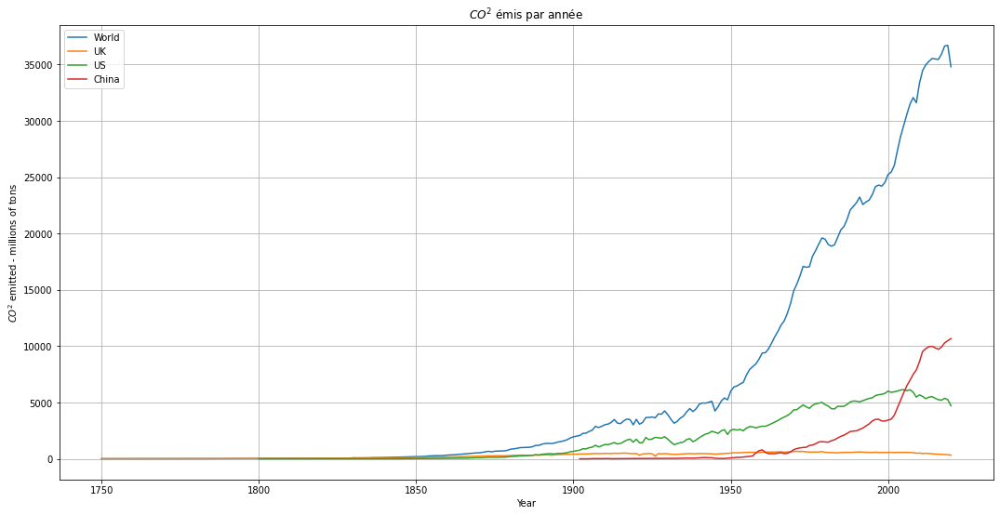

# Jeux de données

## Identification des sources

Nous avons identifié deux sources de données pour nos recherches : [Berkeley Earth](http://berkeleyearth.org/data/) et [Our world in data](https://ourworldindata.org/). 

[Berkeley Earth](http://berkeleyearth.org/data/) est une organisation américaine indépendante qui fournit des données de température historiques nettoyées et cross-vérifiées. Recoupant elle-même plusieurs sources, notamment l'analyse [GISTEMP](https://data.giss.nasa.gov/gistemp/) réalisée sous l'égide de la NASA, elle fournit un ensemble de jeux de données actualisés, les mesures vont jusqu'à 2021, et complets, avec plus de 19 millions d’observations depuis 46 000 stations météo.

[Our world in data](https://ourworldindata.org/) est un organisme reconnu pour la qualité de leurs publications de données sur un ensemble de sujets d'actualité tels que la pollution, la santé ou la population. Leurs données sont librement [téléchargeables sur GitHub](https://github.com/owid/), et sont notamment utilisés pour [l'enseignement et la recherche](https://ourworldindata.org/coverage) à travers le monde. Nous nous appuyons sur leurs données d'émission de $CO_2$ disponibles dans [leur référentiel GitHub](https://github.com/owid/co2-data).

## Données de températures

Les jeux de données de Berkely Earth sont fournis sous forme de fichiers `.txt`, chacun d’entre eux correspondant à une région (totalité du globe, par hémisphère ou par pays). La fréquence d'échantillonage est mensuelle.

Ils sont tous construits de la même manière, avec en en-tête une description complète, incluant un élément crucial : une liste de 12 températures de **référence absolues mensuelles** et leur incertitude sur une période fixe de 30 ans, de janvier 1951 à décembre 1980. Cette période a été retenue d'une part pour la fiabilité et la complétude des observations effectuées, mais également car elle représente une sorte de médiane sur l'ensemble du dataset. Ensuite, un tableau donne le détail des résultats moyens sous forme d’**anomalies**, ou **températures relatives**, assorties de leur incertitude, observés par mois pour la région donnée, pour une période allant de 1750 au plus tôt, et jusqu’en 2021. L’**anomalie de température** est une value relative, exprimée en degrés Celsius correspondant à l’écart, positif ou négatif, entre la température mesurée et la température moyenne de référence correspondante. Plus d'information concernant ce mesurement et l'intérêt de raisonner en termes d'anomalies peut être trouvé sur [le site de la NASA](https://data.giss.nasa.gov/gistemp/faq/abs_temp.html). L’**incertitude** est la dispersion liée à différents facteurs, notamment de sous-échantillonnage statistique et spatial, influant _in fine_ sur la qualité de la mesure. Elle représente l'intervalle de confiance à 95 %.

Ces références nous permettront de calculer les températures en valeurs absolues.

Les données sont réparties sur 12 colonnes :
* Les quatre premières colonnes fournissent les informations suivantes : l’année, le mois de l’année, l’anomalie de température moyenne estimée pour ce mois et son incertitude.
* Les huit dernières colonnes rapportent les anomalies et incertitudes sous la forme de moyennes glissantes annuelles, quinquennales, décennales et vicennales, centrées sur le mois considéré. Par exemple, la moyenne annuelle de janvier à décembre 1950 est rapportée à juin 1950, ce qui explique la présence de « NaNs » en début et fin de ces colonnes dans les Data Sets.

Les fichiers que nous utilisons pour nos analyses ont tous été récupérés sur le site de Berkeley Earth, et sont les suivants :
* Températures globales :
  - `Complete_TAVG_complete.txt` : liste des températures globales moyennes sur terres. 
* Températures par hemisphères :
  - `northern-hemisphere-TAVG-Trend.txt` : liste des températures moyennes par hémisphère (nord) 
  - `southern-hemisphere-TAVG-Trend.txt` : liste des températures moyennes par hémisphère (sud)
* Températures par pays :
  - `Sets_by_country` : liste des températures moyennes par pays. 

### Températures globales

Les informations de colonnes sont les suivantes :

| Nom   | Type    |NaNs| Description | Exemple | Moyenne | Min | Max |
|-------|---------|----|-------------|---------|---------|-----|-----|
| date  | datetime| 0  | Date au format yyyy-mm-dd. |1950-12-24|X|X|X|
| year  | int     | 0  | L'année au format xxxx. |1950|X|X|X| 
| month | int     | 0  | Le mois au format numérique. |120|X|X|X|
| ano   | float   | 1  | Anomalie constatée (°C). |0.122|-0.265|-6.018|5.531|
| uncert| float   | 3  | Incertitude (°C). |0.041|0.903|0.022|6.521|
| abs   | float   | 1  | Température absolue (°C).|13.124|8.329|-2.423|17.780|

Les données étant mensuelles, nous pouvons observer des variations saisonales en cycles annuels, matérialisées par les bandes de couleurs. la moyenne annuelle glissante, en noir dans le graphique ci-dessous, 

Nous visualisons également les températures moyennes par année, en affichant la marge d'incertitude. Les écarts de température plus importants en début de dataset sont confirmés par la forte marge d'incertitude, en grande partie due à la rareté et au manque de précision des capteurs utilisés au 18ème siècle.

### Températures par hémisphère

### Températures par pays

## Données de dioxyde de carbone

Nous identifions deux jeux de données pour le $CO_2$ : le premier est la quantité totale produite par pays et par an, l'autre détaille les émissions dues à la production industrielle et à l'utilisation des sols, tous pays confondus et par an.

Les données sont téléchargées depuis [le référentiel GitHub de Our World in Data](https://nyc3.digitaloceanspaces.com/owid-public/data/co2/owid-co2-data.csv). Le fichier contient les colonnes suivantes :

| Nom   | Type    |NaNs| Description | Exemple | Moyenne | Min | Max |
|-------|---------|----|-------------|---------|---------|-----|-----|
| year  | int     | 0  | L'année au format xxxx. |1950|X|X|X| 
| ico_code   | object   | 4029  | Code ISO du pays. |AFG|X|X|X|
| country| object   | 0  | Dénomination usuelle du pays. |Afghanistan|X|X|X|
| co2   | float   | 1319  | Quantité de $CO^2$ émise (millions de tonnes).|5.333|326.658|0|36702.503|
| gpd | float | 12520 | Produit Intérieur Brut (\$). |3.045e+10|2.89e+11|5.543e+07|1.136e+14|
| population | float | 3097 | Population du pays. |4.87e+06|7.068e+07|1490|7.795e+09|
| total_ghg | float   | 20338  | Quantité totale de gaz à effet de serre émise, en équivalent de $CO^2$ (millions de tonnes).|33.9|420.52|-178.71|48939.71|

Les pays sont identifiés par leur trigramme ISO 3166 - alpha-3, et comme pour les températures, les données peuvent manquer en fonction des années et des pays. Affichons un graphe rapide de la production de $CO_2$ pour quelques pays :

Nous reformatons les 

## Aggrégation

